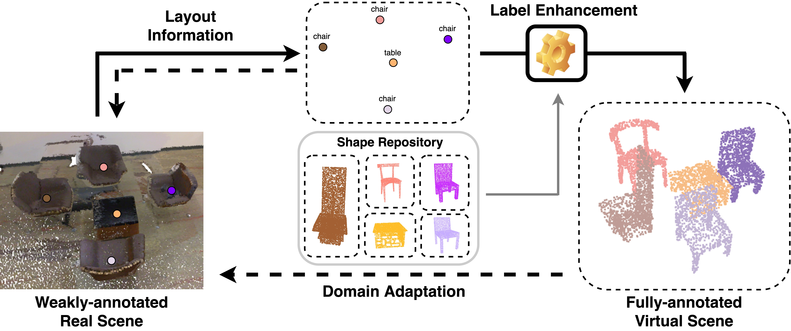
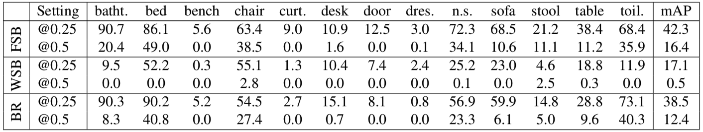

# Back To Reality: Weakly-supervised 3D Object Detection with Shape-guided Label Enhancement

## Announcement 🔥

We have not tested the code yet. We will finish this project by April!!!

## Introduction

This repo contains PyTorch implementation for paper [Back To Reality: Weak-supervised 3D Object Detection with Shape-guided Label Enhancement](http://arxiv.org/abs/2203.05238) (CVPR2022)



```
@inproceedings{xu2022br,
author = {Xu, Xiuwei and Wang, Yifan and Zheng, Yu and Rao, Yongming and Zhou, Jie and Lu, Jiwen},
title = {Back To Reality: Weak-supervised 3D Object Detection with Shape-guided Label Enhancement},
booktitle = {IEEE Conference on Computer Vision and Pattern Recognition (CVPR)},
year = {2022}
}
```

Other papers related to 3D object detection with synthetic shape:
- RandomRooms: Unsupervised Pre-training from Synthetic Shapes and Randomized Layouts for 3D Object Detection ([ICCV 2021](https://arxiv.org/abs/2108.07794))


## New dataset 💥
We conduct additional experiment on the more challenging [Matterport3D](https://niessner.github.io/Matterport/) dataset. From ModelNet40 and Matterport3D, we select all 13 shared categories, each containing more than 80 object instances in Matterport3D training set, to construct our benchmark (Matterport3d-md40). Below is the performance of FSB, WSB and BR (point-version) based on Votenet:


Note that we use OpenCV to estimate the rotated bounding boxes (RBB) as ground-truth, instead of the axis-aligned bounding boxes used in ScanNet-md40 benchmark.

`ScanNet-md40` and `Matterport3d-md40` are two more challenging benckmarks for indoor 3D object detection. We hope they will promote future research on small object detection and synthetic-to-real scene understanding.


## Dependencies
We evaluate this code with Pytorch 1.8.1 (cuda11), which is based on the official implementation of [Votenet](https://github.com/facebookresearch/votenet) and [GroupFree3D](https://github.com/zeliu98/Group-Free-3D). Please follow the requirements of them to prepare the environment. Other packages can be installed using:
```
pip install open3d sklearn tqdm
```

Current code base is tested under following environment:
1. Python         3.6.13
2. PyTorch        1.8.1
3. numpy          1.19.2
4. open3d         0.12.0
5. opencv-python  4.5.1.48
6. plyfile        0.7.3
7. scikit-learn   0.24.1


## Data preparation

### ScanNet
To start from the raw data, you should:

* Follow the [README](./detection/Votenet/scannet/README.md) under `GroupFree3D/scannet` or `Votenet/scannet` to generate the real scenes. 
* Follow the [README](./data_generation/ScanNet/README.md) under `./data_generation/ScanNet` to generate the virtual scenes.

The processed data can also be downloaded from [here](https://drive.google.com/drive/folders/1hKjYXdHIpk8a1IPG_k4WmFacSPlfTYwZ?usp=sharing). They should be placed to paths:

```.
./detection/Votenet/scannet/
./detection/GroupFree3D/scannet/
```

After that, the file directory should be like:

```.
...
└── Votenet (or GroupFree3D)
    ├── ...
    └── scannet
        ├── ...
        ├── scannet_train_detection_data_md40
        ├── scannet_train_detection_data_md40_obj_aug
        └── scannet_train_detection_data_md40_obj_mesh_aug
```

### Matterport3D
To start from the raw data, you should:

* Follow the [README](./detection/Votenet/matterport/README.md) under `Votenet/matterport` to generate the real scenes. 
* Follow the [README](./data_generation/Matterport3D/README.md) under `./data_generation/Matterport3D` to generate the virtual scenes.

The processed data can also be downloaded from [here](https://drive.google.com/drive/folders/166w4w9xa8c7WITDAGswEsDQ8cJxBJomn?usp=sharing).

The file directory should be like:

```.
...
└── Votenet
    ├── ...
    └── matterport
        ├── ...
        ├── matterport_train_detection_data_md40
        ├── matterport_train_detection_data_md40_obj_aug
        └── matterport_train_detection_data_md40_obj_mesh_aug
```

## Usage

Please follow the instructions below to train different models on ScanNet. Change `--dataset scannet` to `--dataset matterport` for training on Matterport3D.

### Votenet

#### 1. Fully-Supervised Baseline

To train the Fully-Supervised Baseline (FSB) on Scannet data:

```.
# Recommended GPU num: 1

cd Votenet

CUDA_VISIBLE_DEVICES=0 python train_Votenet_FSB.py --dataset scannet --log_dir log_Votenet_FSB --num_point 40000

```

#### 2. Weakly-Supervised Baseline

To train the Weakly-Supervised Baseline (WSB) on Scannet data:

```.
# Recommended num of GPUs: 1

CUDA_VISIBLE_DEVICES=0 python train_Votenet_WSB.py --dataset scannet --log_dir log_Votenet_WSB --num_point 40000

```

#### 3. Back To Reality

To train BR (mesh-version) on Scannet data, please run:

```.
# Recommended num of GPUs: 2

CUDA_VISIBLE_DEVICES=0,1 python train_Votenet_BR.py --dataset scannet --log_dir log_Votenet_BRM --num_point 40000

CUDA_VISIBLE_DEVICES=0,1 python train_Votenet_BR_CenterRefine --dataset scannet --log_dir log_Votenet_BRM_Refine --num_point 40000 --checkpoint_path log_Votenet_BRM/train_BR.tar

```

To train BR (point-version) on Scannet data, please run:

```.
# Recommended num of GPUs: 2

CUDA_VISIBLE_DEVICES=0,1 python train_Votenet_BR.py --dataset scannet --log_dir log_Votenet_BRP --num_point 40000 --dataset_without_mesh

CUDA_VISIBLE_DEVICES=0,1 python train_Votenet_BR_CenterRefine --dataset scannet --log_dir log_Votenet_BRP_Refine --num_point 40000 --checkpoint_path log_Votenet_BRP/train_BR.tar --dataset_without_mesh

```

### GroupFree3D

#### 1. Fully-Supervised Baseline

To train the Fully-Supervised  Baseline (FSB) on Scannet data:

```.
# Recommended num of GPUs: 4

cd GroupFree3D

python -m torch.distributed.launch --master_port <port_num> --nproc_per_node <num_of_gpus_to_use> train_GF_FSB.py --num_point 50000 --num_decoder_layers 6 --size_delta 0.111111111111 --center_delta 0.04 --learning_rate 0.006 --decoder_learning_rate 0.0006 --weight_decay 0.0005 --dataset scannet --log_dir log_GF_FSB --batch_size 4
```

#### 2. Weakly-Supervised Baseline

To train the Weakly-Supervised Baseline (WSB) on Scannet data:

```.
# Recommended num of GPUs: 4

python -m torch.distributed.launch --master_port <port_num> --nproc_per_node <num_of_gpus_to_use> train_GF_WSB.py --num_point 50000 --num_decoder_layers 6 --size_delta 0.111111111111 --center_delta 0.04 --learning_rate 0.006 --decoder_learning_rate 0.0006 --weight_decay 0.0005 --dataset scannet --log_dir log_GF_WSB --batch_size 4
```

#### 3. Back To Reality

To train BR (mesh-version) on Scannet data, please run:

```.
# Recommended num of GPUs: 4

python -m torch.distributed.launch --master_port <port_num> --nproc_per_node <num_of_gpus_to_use> train_GF_BR.py --num_point 50000 --num_decoder_layers 6 --size_delta 0.111111111111 --center_delta 0.04 --learning_rate 0.006 --decoder_learning_rate 0.0006 --weight_decay 0.0005 --dataset scannet --log_dir log_GF_BRM --batch_size 4

# Recommended num of GPUs: 6

python -m torch.distributed.launch --master_port <port_num> --nproc_per_node <num_of_gpus_to_use> train_GF_BR_CenterRefine.py --num_point 50000 --num_decoder_layers 6 --size_delta 0.111111111111 --center_delta 0.04 --learning_rate 0.001 --decoder_learning_rate 0.0006 --weight_decay 0.0005 --dataset scannet --log_dir log_GF_BRM_Refine --checkpoint_path <[checkpoint_path_of_groupfree3D]/ckpt_epoch_last.pth> --max_epoch 120 --val_freq 10 --save_freq 20 --batch_size 2
```

To train BR (point-version) on Scannet data, please run:

```.
# Recommended num of GPUs: 4

python -m torch.distributed.launch --master_port <port_num> --nproc_per_node <num_of_gpus_to_use> train_GF_BR.py --num_point 50000 --num_decoder_layers 6 --size_delta 0.111111111111 --center_delta 0.04 --learning_rate 0.006 --decoder_learning_rate 0.0006 --weight_decay 0.0005 --dataset scannet --log_dir log_GF_BRP --batch_size 4 --dataset_without_mesh

# Recommended num of GPUs: 6

python -m torch.distributed.launch --master_port <port_num> --nproc_per_node <num_of_gpus_to_use> train_GF_BR_CenterRefine.py --num_point 50000 --num_decoder_layers 6 --size_delta 0.111111111111 --center_delta 0.04 --learning_rate 0.001 --decoder_learning_rate 0.0006 --weight_decay 0.0005 --dataset scannet --log_dir log_GF_BRP_Refine --checkpoint_path <[checkpoint_path_of_groupfree3D]/ckpt_epoch_last.pth> --max_epoch 120 --val_freq 10 --save_freq 20 --batch_size 2 --dataset_without_mesh
```


## Acknowledgements

We thank a lot for the flexible codebase of [Votenet](https://github.com/facebookresearch/votenet) and [GroupFree3D](https://github.com/zeliu98/Group-Free-3D).
